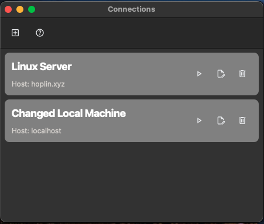

## Server Manager

Just personal usage gui application for manging multiple ssh connections. ~~Not gonna make PyQt GUI ever never again~~

- Multiple SSH Connection Save / Edit / Remove
- Dashboard for each connection servers
  - CPU Usage
  - Memory Usage
  - Disk I/O (Read / Write)
  - Network (Rx / Tx)
- Terminal for each connection

### Supports

- OS

  - Linux: Fully Support
  - Mac: Partially Support
  - Window: Unsupported

- Shell(In Terminal)
  - sh: Fully Supported
  - bash: Fully Supported
  - ZSH: Partially Support

### Graphics

    
    
    
    

